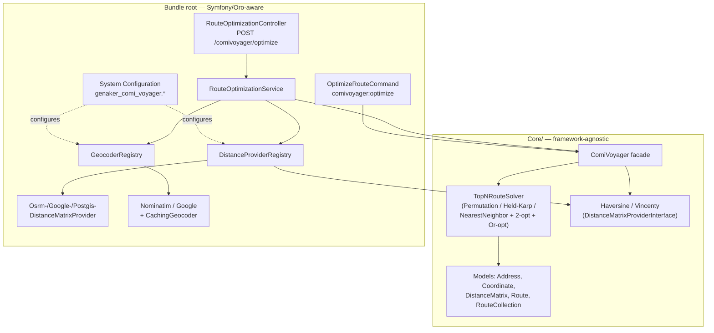

# GenakerComiVoyagerBundle

A self-contained OroCommerce bundle that solves the **"visit N addresses in the
shortest order"** problem (Traveling Salesman Problem / route optimization),
exposed as a:

- pure-PHP **Core** library (`Core/`, zero Symfony/Oro dependencies),
- CLI command (`comivoyager:optimize`),
- frontend HTTP API (`POST /comivoyager/optimize`),
- Oro **System Configuration** screen to pick the distance method, geocoder,
  and provider credentials.

It returns the **top-N shortest routes** (not just the single best one), so
callers can compare alternatives, with full per-leg distance breakdowns.

---

## Table of contents

1. [Architecture](#architecture)
2. [Quick start](#quick-start)
3. [Distance providers](#distance-providers)
4. [Geocoders](#geocoders)
5. [Route-solving algorithms](#route-solving-algorithms)
6. [Configuration](#configuration)
7. [API & CLI](#api--cli)
8. [Docker / installation](#docker--installation)
9. [Testing](#testing)

Detailed docs live in [`doc/`](doc/):

| Doc | Contents |
|---|---|
| [doc/USE_CASE.md](doc/USE_CASE.md) | The problem ComiVoyager solves, how, and why it matters for e-commerce/OroCommerce |
| [doc/INSTALLATION.md](doc/INSTALLATION.md) | Docker Compose setup, env vars, PostGIS DB, migrations, troubleshooting |
| [doc/DISTANCE_PROVIDERS.md](doc/DISTANCE_PROVIDERS.md) | Every distance method explained, with accuracy/cost/latency analysis and pros/cons |
| [doc/GEOCODING.md](doc/GEOCODING.md) | Nominatim vs Google geocoders, caching strategy, pros/cons |
| [doc/ALGORITHMS.md](doc/ALGORITHMS.md) | TSP solver internals (exact vs heuristic), complexity, pros/cons |
| [doc/API.md](doc/API.md) | HTTP API and CLI reference, request/response schemas |
| [doc/CONFIGURATION.md](doc/CONFIGURATION.md) | System Configuration fields reference |

---

## Architecture

```
Core/                           <- framework-agnostic TSP engine (no Symfony/Oro imports)
  Contract/
    DistanceMatrixProviderInterface.php
    GeocoderInterface.php
  Model/                        Address, Coordinate, DistanceMatrix, Route, RouteCollection, ...
  Distance/                     Haversine, Vincenty (pure-math providers)
  Solver/                       Permutation, Held-Karp, NearestNeighbor, 2-opt, Or-opt, TopNRouteSolver
  ComiVoyager.php                <- facade: addresses + provider -> RouteCollection
  Exception/

Distance/                       <- Symfony/Oro-aware distance providers
  OsrmDistanceMatrixProvider.php       road distance via OSRM HTTP API
  GoogleDistanceMatrixProvider.php     road distance via Google Distance Matrix API
  PostgisDistanceMatrixProvider.php    great-circle distance via PostGIS ST_DistanceSphere
  DistanceProviderRegistry.php         resolves configured/requested provider by name

Geocoder/                        <- address -> coordinate resolution
  NominatimGeocoder.php          OpenStreetMap Nominatim (free, default)
  GoogleGeocoder.php              Google Geocoding API
  CachingGeocoder.php             DB-backed cache decorator
  GeocoderRegistry.php            resolves configured/requested geocoder by name

Entity/GeocodeCache.php          geocode result cache table
Repository/GeocodeCacheRepository.php

Service/RouteOptimizationService.php   orchestrates: geocode -> resolve provider -> ComiVoyager::optimize()
Controller/RouteOptimizationController.php   POST /comivoyager/optimize
Command/OptimizeRouteCommand.php       comivoyager:optimize CLI

DependencyInjection/             Configuration (system config tree) + Extension (DI wiring, prepend())
Migrations/Schema/               creates genaker_comivoyager_geocode_cache table
Resources/config/oro/            routing, ACLs, system_configuration screen
```

**Design principle**: `Core/` has zero framework dependencies and could be
extracted into its own Composer package. Everything Symfony/Oro-aware
(HTTP clients, Doctrine, `ConfigManager`, controllers) lives outside `Core/`
and depends *on* it, never the other way around.

### Component diagram



`Service`/`Command` resolve a provider/geocoder via the registries (config
default or per-request override), then call the unchanged `Core::optimize()`
— the same Core code path regardless of which provider or integration
(HTTP vs CLI) is used.

---

## Quick start

```bash
# 1. Bring up the app + databases (see doc/INSTALLATION.md for PostGIS setup)
docker compose up -d

# 2. CLI smoke test (pure PHP, no external services needed)
echo '[
  {"label":"London","lat":51.5074,"lng":-0.1278},
  {"label":"Paris","lat":48.8566,"lng":2.3522},
  {"label":"Berlin","lat":52.5200,"lng":13.4050}
]' | php bin/console comivoyager:optimize - --method=haversine --routes=2

# 3. HTTP API (logged-in frontend session required, see doc/API.md)
curl -X POST http://localhost:8000/comivoyager/optimize \
  -H 'Content-Type: application/json' \
  -d '{
    "addresses": [
      {"label":"London","lat":51.5074,"lng":-0.1278},
      {"label":"Paris","lat":48.8566,"lng":2.3522},
      {"label":"Berlin","lat":52.5200,"lng":13.4050}
    ],
    "method": "haversine",
    "routes": 2
  }'
```

---

## Distance providers

| Provider | Type | External call? | Accounts for roads? | Best for |
|---|---|---|---|---|
| `haversine` | great-circle (sphere) | No | No | Default; fast estimates, large batches |
| `vincenty` | geodesic (WGS-84 ellipsoid) | No | No | Slightly higher accuracy than haversine, still free |
| `osrm` | road network (driving) | Yes (HTTP) | Yes | Realistic driving distances, free public/self-hosted server |
| `google` | road network (driving) | Yes (HTTP, paid) | Yes | Production-grade road distances + traffic, needs API key |
| `postgis` | great-circle (sphere), via SQL | Yes (DB) | No | Same math as haversine but computed in DB; useful when coordinates already live in Postgres |

See [doc/DISTANCE_PROVIDERS.md](doc/DISTANCE_PROVIDERS.md) for a full
analysis of accuracy, latency, cost, rate limits, and failure modes for each.

## Geocoders

| Geocoder | Cost | Rate limit | Notes |
|---|---|---|---|
| `nominatim` (default) | Free | ~1 req/s (usage policy) | OpenStreetMap data; no API key |
| `google` | Paid (per request) | High, billed | Requires `google_api_key`; generally higher hit-rate for messy addresses |

Both can be wrapped in a DB-backed cache (`enable_geocode_cache`, on by
default) so the same address text is only resolved once. See
[doc/GEOCODING.md](doc/GEOCODING.md).

## Route-solving algorithms

The `TopNRouteSolver` picks a strategy based on the number of stops `n`:

| `n` | Strategy | Guarantee |
|---|---|---|
| ≤ 9 | Exhaustive permutations (`PermutationSolver`) | True optimum + true top-N |
| ≤ 15 | Held-Karp DP + nearest-neighbor/2-opt/Or-opt restarts | True optimum (Held-Karp) + good runners-up |
| > 15 | Nearest-neighbor + 2-opt + Or-opt, multiple restarts | Near-optimal heuristic, no exactness guarantee |

The HTTP API caps requests at `genaker_comi_voyager.max_addresses`
(default **9**, matching the exhaustive solver's practical ceiling —
n=9 solves in ~3.4 s, n=10 would take ~7 minutes and ~4 GB; see
[doc/ALGORITHMS.md](doc/ALGORITHMS.md) for measurements).

See [doc/ALGORITHMS.md](doc/ALGORITHMS.md) for complexity, pros/cons of each
strategy.

---

## Configuration

All settings live under **System Configuration → Integrations → ComiVoyager
Settings** (`genaker_comi_voyager.*`). See
[doc/CONFIGURATION.md](doc/CONFIGURATION.md) for the full field reference.

## API & CLI

See [doc/API.md](doc/API.md) for the full HTTP request/response schema, error
codes, and CLI options.

## Docker / installation

See [doc/INSTALLATION.md](doc/INSTALLATION.md) for Docker Compose setup,
the optional PostGIS database, environment variables, and migrations.

## Testing

### Unit tests

```bash
php bin/phpunit --no-coverage src/Genaker/Bundle/ComiVoyager
```

111 unit tests cover the Core engine (models, solvers, distance math),
distance providers (HTTP/DB mocked, including the single-query PostGIS
batching), geocoders (HTTP/DB mocked), the CLI command, and the
`RouteOptimizationController`/`ConnectionTestController` HTTP controllers
(including `max_addresses` enforcement and lat/lng validation). No live
network/DB access is required for the test suite.

### E2E tests

See [`tests/README.md`](tests/README.md) for the Playwright-based
`POST /comivoyager/optimize` E2E suite, which runs against a live app.

### Static analysis (PHPStan)

PHPStan is **not** a project-wide composer dependency. To analyze just this
bundle without touching `composer.json`/`composer.lock`, download a
standalone `phpstan.phar` and point it at the bundle with a throwaway config:

```bash
curl -sL https://github.com/phpstan/phpstan/releases/latest/download/phpstan.phar -o /tmp/phpstan.phar
chmod +x /tmp/phpstan.phar
```

```yaml
# /tmp/phpstan-comivoyager.neon
parameters:
    level: 5
    treatPhpDocTypesAsCertain: false
    paths:
        - /oro-ee/src/Genaker/Bundle/ComiVoyager
    excludePaths:
        - /oro-ee/src/Genaker/Bundle/ComiVoyager/tests/e2e
    tmpDir: /tmp/phpstan-tmp
```

`treatPhpDocTypesAsCertain: false` avoids false positives where PHPDoc array
shapes (e.g. `resolveAddresses()`'s `@param array<int, array{...}>`) describe
the *expected* shape of untrusted JSON input, while the code still runtime-
checks it (`is_array($entry)`, etc.) before trusting it.

```bash
php -d memory_limit=2G /tmp/phpstan.phar analyse \
    -c /tmp/phpstan-comivoyager.neon \
    --autoload-file=/oro-ee/vendor/autoload.php
```

This currently reports **no errors**.
