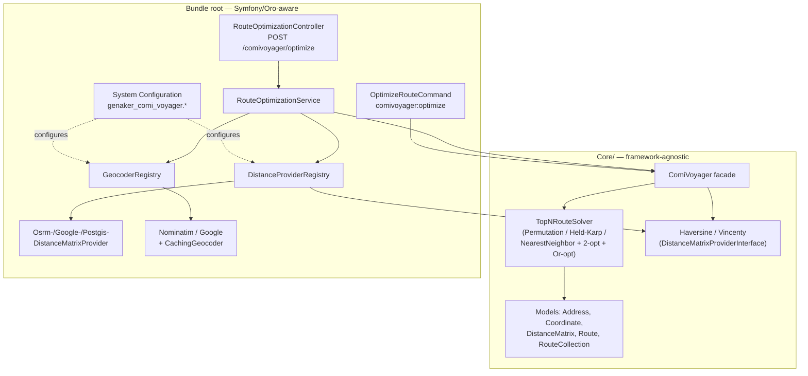

# GenakerComiVoyagerBundle

A self-contained OroCommerce bundle for **delivery route optimization**. It
solves two related problems:

1. **TSP (single vehicle)** — *"visit N addresses in the shortest order"*.
   Returns the **top-N shortest routes** so callers can compare alternatives,
   with full per-leg distance breakdowns.
2. **VRP (multiple vehicles)** — *"split N delivery orders across K drivers so
   each drives the shortest possible route, covering nearby addresses
   together"*. Each driver gets a geographically tight cluster, optimally
   sequenced, respecting weight capacity, max stops, delivery radius, shift
   hours, and a custom start/end point.

Exposed as a:

- pure-PHP **Core** library (`Core/`, zero Symfony/Oro dependencies),
- CLI commands (`comivoyager:optimize`, `comivoyager:vrp:optimize`),
- frontend HTTP API (`POST /comivoyager/optimize`, `POST /comivoyager/vrp/optimize`),
- Oro **System Configuration** screen to pick the distance method, geocoder,
  and provider credentials.

---

## Table of contents

1. [Architecture](#architecture)
2. [Quick start](#quick-start)
3. [Distance providers](#distance-providers)
4. [Geocoders](#geocoders)
5. [Route-solving algorithms](#route-solving-algorithms)
6. [Multi-vehicle routing (VRP)](#multi-vehicle-routing-vrp)
7. [Configuration](#configuration)
8. [API & CLI](#api--cli)
9. [Docker / installation](#docker--installation)
10. [Testing](#testing)

Detailed docs live in [`doc/`](doc/):

| Doc | Contents |
|---|---|
| [doc/USE_CASE.md](doc/USE_CASE.md) | The problem ComiVoyager solves, how, and why it matters for e-commerce/OroCommerce |
| [doc/VRP_PROBLEM_DEFINITION.md](doc/VRP_PROBLEM_DEFINITION.md) | Multi-vehicle delivery problem: B2B vs B2C, constraints, clustering + routing strategy |
| [doc/INSTALLATION.md](doc/INSTALLATION.md) | Docker Compose setup, env vars, PostGIS DB, migrations, troubleshooting |
| [doc/DISTANCE_PROVIDERS.md](doc/DISTANCE_PROVIDERS.md) | Every distance method explained, with accuracy/cost/latency analysis and pros/cons |
| [doc/GEOCODING.md](doc/GEOCODING.md) | Nominatim vs Google geocoders, caching strategy, pros/cons |
| [doc/ALGORITHMS.md](doc/ALGORITHMS.md) | TSP solver internals (exact vs heuristic), complexity, pros/cons |
| [doc/API.md](doc/API.md) | HTTP API and CLI reference, request/response schemas |
| [doc/CONFIGURATION.md](doc/CONFIGURATION.md) | System Configuration fields reference |

---

## Architecture

```
Core/                           <- framework-agnostic engine (no Symfony/Oro imports)
  Contract/
    DistanceMatrixProviderInterface.php
    GeocoderInterface.php
  Model/                        Address, Coordinate, DistanceMatrix, Route, RouteCollection,
                                Vehicle, DeliveryOrder, VRPRoute, VRPSolution, RouteStop (VRP models)
  Distance/                     Haversine, Vincenty (pure-math providers)
  Clustering/                   KMeansClusterer, CapacityAdjuster (VRP — split orders per driver)
  Solver/                       Permutation, Held-Karp, NearestNeighbor, 2-opt, Or-opt, TopNRouteSolver
                                RouteSequencer (VRP — order one driver's stops with custom start/end + per-leg ETA)
                                VRPSolver (VRP — cluster -> adjust -> sequence -> trim)
  ComiVoyager.php                <- TSP facade: addresses + provider -> RouteCollection
  Exception/

Distance/                       <- Symfony/Oro-aware distance providers
  OsrmDistanceMatrixProvider.php       road distance via OSRM HTTP API
  GoogleDistanceMatrixProvider.php     road distance via Google Distance Matrix API
  PostgisDistanceMatrixProvider.php    great-circle distance via PostGIS ST_DistanceSphere
  DistanceProviderRegistry.php         resolves configured/requested provider by name

Geocoder/                        <- address -> coordinate resolution
  NominatimGeocoder.php          OpenStreetMap Nominatim (free, default)
  GoogleGeocoder.php              Google Geocoding API
  CachingGeocoder.php             DB-backed cache decorator
  GeocoderRegistry.php            resolves configured/requested geocoder by name

Entity/GeocodeCache.php          geocode result cache table
Repository/GeocodeCacheRepository.php

Solver/GoogleFleetRoutingSolver.php     Google Cloud Fleet Routing API backend
Solver/VRPSolverRegistry.php           resolves configured/per-request VRP backend (local / google)
Provider/OroOrderProvider.php          pulls ready-to-ship Oro orders -> geocode -> DeliveryOrder[]
Provider/OrderWeightResolverInterface.php  pluggable order-weight source (NullWeightResolver default)

Service/RouteOptimizationService.php   orchestrates: geocode -> resolve provider -> ComiVoyager::optimize()
Controller/RouteOptimizationController.php   POST /comivoyager/optimize (TSP)
Controller/VRPController.php           POST /comivoyager/vrp/optimize + /vrp/optimize-orders (VRP)
Controller/RoutePlannerController.php  GET  /admin/comivoyager/planner (dispatcher UI)
Command/OptimizeRouteCommand.php       comivoyager:optimize CLI (TSP)
Command/VRPOptimizeCommand.php         comivoyager:vrp:optimize CLI (VRP)
Resources/views/RoutePlanner/         planner UI (driver cards + CSV export)

DependencyInjection/             Configuration (system config tree) + Extension (DI wiring, prepend())
Migrations/Schema/               creates genaker_comivoyager_geocode_cache table
Resources/config/oro/            routing, ACLs, system_configuration screen
```

**Design principle**: `Core/` has zero framework dependencies and could be
extracted into its own Composer package. Everything Symfony/Oro-aware
(HTTP clients, Doctrine, `ConfigManager`, controllers) lives outside `Core/`
and depends *on* it, never the other way around.

### Component diagram



`Service`/`Command` resolve a provider/geocoder via the registries (config
default or per-request override), then call the unchanged `Core::optimize()`
— the same Core code path regardless of which provider or integration
(HTTP vs CLI) is used.

---

## Quick start

```bash
# 1. Bring up the app + databases (see doc/INSTALLATION.md for PostGIS setup)
docker compose up -d

# 2. CLI smoke test (pure PHP, no external services needed)
echo '[
  {"label":"London","lat":51.5074,"lng":-0.1278},
  {"label":"Paris","lat":48.8566,"lng":2.3522},
  {"label":"Berlin","lat":52.5200,"lng":13.4050}
]' | php bin/console comivoyager:optimize - --method=haversine --routes=2

# 3. HTTP API (logged-in frontend session required, see doc/API.md)
curl -X POST http://localhost:8000/comivoyager/optimize \
  -H 'Content-Type: application/json' \
  -d '{
    "addresses": [
      {"label":"London","lat":51.5074,"lng":-0.1278},
      {"label":"Paris","lat":48.8566,"lng":2.3522},
      {"label":"Berlin","lat":52.5200,"lng":13.4050}
    ],
    "method": "haversine",
    "routes": 2
  }'
```

---

## Distance providers

| Provider | Type | External call? | Accounts for roads? | Best for |
|---|---|---|---|---|
| `haversine` | great-circle (sphere) | No | No | Default; fast estimates, large batches |
| `vincenty` | geodesic (WGS-84 ellipsoid) | No | No | Slightly higher accuracy than haversine, still free |
| `osrm` | road network (driving) | Yes (HTTP) | Yes | Realistic driving distances, free public/self-hosted server |
| `google` | road network (driving) | Yes (HTTP, paid) | Yes | Production-grade road distances + traffic, needs API key |
| `postgis` | great-circle (sphere), via SQL | Yes (DB) | No | Same math as haversine but computed in DB; useful when coordinates already live in Postgres |

See [doc/DISTANCE_PROVIDERS.md](doc/DISTANCE_PROVIDERS.md) for a full
analysis of accuracy, latency, cost, rate limits, and failure modes for each.

## Geocoders

| Geocoder | Cost | Rate limit | Notes |
|---|---|---|---|
| `nominatim` (default) | Free | ~1 req/s (usage policy) | OpenStreetMap data; no API key |
| `google` | Paid (per request) | High, billed | Requires `google_api_key`; generally higher hit-rate for messy addresses |

Both can be wrapped in a DB-backed cache (`enable_geocode_cache`, on by
default) so the same address text is only resolved once. See
[doc/GEOCODING.md](doc/GEOCODING.md).

## Route-solving algorithms

The `TopNRouteSolver` picks a strategy based on the number of stops `n`:

| `n` | Strategy | Guarantee |
|---|---|---|
| ≤ 9 | Exhaustive permutations (`PermutationSolver`) | True optimum + true top-N |
| ≤ 15 | Held-Karp DP + nearest-neighbor/2-opt/Or-opt restarts | True optimum (Held-Karp) + good runners-up |
| > 15 | Nearest-neighbor + 2-opt + Or-opt, multiple restarts | Near-optimal heuristic, no exactness guarantee |

The HTTP API caps requests at `genaker_comi_voyager.max_addresses`
(default **9**, matching the exhaustive solver's practical ceiling —
n=9 solves in ~3.4 s, n=10 would take ~7 minutes and ~4 GB; see
[doc/ALGORITHMS.md](doc/ALGORITHMS.md) for measurements).

See [doc/ALGORITHMS.md](doc/ALGORITHMS.md) for complexity, pros/cons of each
strategy.

---

## Multi-vehicle routing (VRP)

Where the TSP solver answers *"what order should **one** driver visit these
stops?"*, the **Vehicle Routing Problem (VRP)** solver answers *"how do I split
N delivery orders across **K** drivers so each covers a tight area and drives
the least?"* — the classic local-delivery dispatch problem.

### Pipeline

```
orders + drivers + depot
        │
        ▼
1. K-Means clustering   → split addresses into K geographic zones (one per driver)
        │
        ▼
2. Capacity adjustment  → enforce weight / max-stops / delivery-radius;
        │                  redistribute overflow to the nearest zone with room
        ▼
3. Route sequencing     → order each zone's stops (nearest-neighbour + 2-opt),
        │                  using each driver's own start, end, and round-trip setting
        ▼
4. Budget trimming      → drop the farthest tail stops until each route fits the
        │                  driver's shift hours and max distance
        ▼
VRPSolution (routes per driver + unassigned + out-of-range)
```

### Per-driver input parameters

Each driver/vehicle (`Core/Model/Vehicle`) is configured independently:

| Parameter | Meaning | Default |
|---|---|---|
| `capacity_lbs` | Max load weight; `0` = unlimited | `0` |
| `max_stops` | Max deliveries per shift; `0` = unlimited | `0` |
| `max_distance_miles` | Driving-distance cap per shift; `0` = unlimited | `0` |
| `start` | Driver's home / start point | shared depot |
| `end` | Explicit end point | — |
| `return_to_start` | Round trip back to start | `true` |
| `avg_speed_mph` | Driving speed, converts miles → hours | `30` |
| `service_time_minutes` | Unload time per stop | `10` |
| `max_work_hours` | Shift length; route trimmed to fit; `0` = unlimited | `0` |

Plus a solver-wide **delivery radius** (default **100 miles**): orders beyond
it are flagged `out_of_range` (handed to an LTL/freight carrier instead of the
local fleet).

### Solver backends

Two solver backends are available. Both implement `VRPSolverInterface` and
produce the same `VRPSolution` output — the caller can switch between them
transparently.

| Backend | Config value | How it works | Cost |
|---|---|---|---|
| **Local** | `local` (default) | K-Means clustering + nearest-neighbour / 2-opt TSP, Haversine distances | Free, offline |
| **Google Cloud Fleet Routing** | `google` | Sends the full problem to Google's Route Optimization API in one request; gets back real-road, traffic-aware routes with per-stop ETAs | ~$5 per vehicle per request |

**Selecting a backend:**

- **System Configuration** → ComiVoyager → *VRP Solver Backend* (persistent
  default for the whole installation)
- **Per-request** — pass `"solver": "google"` or `"solver": "local"` in the
  JSON body of `/vrp/optimize` or `/vrp/optimize-orders`
- The response includes `"solver": "local"` or `"solver": "google"` so the
  caller knows which backend ran.

#### Google Cloud Fleet Routing setup

1. Enable the **Route Optimization API** in your Google Cloud project
   ([console.cloud.google.com/apis](https://console.cloud.google.com/apis)).
2. Create an API key with the Route Optimization API scope.
3. In **System Configuration → ComiVoyager**:
   - Set **Google API Key** to your key
   - Set **Google Cloud Project ID** to your project ID (e.g. `my-project-12345`)
   - Set **VRP Solver Backend** to `Google Cloud Fleet Routing`

**What Google handles that the local solver doesn't:**
- Real road distances and durations (not straight-line Haversine)
- Live traffic conditions
- Turn-by-turn routing constraints (one-way streets, road closures)
- Industrial-grade optimization (Google OR-Tools under the hood)

**What the local solver handles that Google doesn't:**
- Works offline / without a Google Cloud account
- Zero cost regardless of fleet size
- No network latency (~4ms vs ~1-3s)
- No data sent to external services

#### Architecture

```
VRPController
    │
    ▼
VRPSolverRegistry ─── get("local")  ──→ VRPSolver (K-Means + TSP)
    │                                    │
    └── get("google") ──→ GoogleFleetRoutingSolver
                                         │
                                         ▼
                             POST optimizeTours → Google API
                                         │
                                         ▼
                              parseResponse() → VRPSolution
```

Both backends return the same `VRPSolution` with the same `stop_details`,
ETAs, per-leg distances, and `return_leg_miles` — the UI and CSV export
work identically regardless of which solver ran.

### Time budgeting

```
driving_hours = total_distance_miles / avg_speed_mph
service_hours = stop_count × service_time_minutes / 60
shift_hours   = driving_hours + service_hours
```

When `shift_hours` exceeds `max_work_hours` (or distance exceeds
`max_distance_miles`), the solver removes the farthest tail stops into
`unassigned` and re-sequences until the route fits.

### Fleets

- **Homogeneous** — one shared config replicated across `count` drivers.
- **Heterogeneous** — an explicit `drivers` array where each driver has their
  own home, shift length, speed, and truck capacity.

### CLI

```bash
php bin/console comivoyager:vrp:optimize orders.json \
    --vehicles=3 --capacity=40000 --work-hours=8 --speed=35 \
    --max-stops=12 --service-time=15 --radius=100
```

```
Driver 1 — 3 stops, 13.4 miles, 35000 lbs, 0.9 h
Driver 2 — 3 stops, 20.1 miles, 22000 lbs, 1.1 h
[OK] Done in 3.8 ms — 2 vehicles, 33.5 total miles
```

### HTTP API

```
POST /comivoyager/vrp/optimize
{
  "depot": {"lat": 40.7128, "lng": -74.0060},
  "max_radius_miles": 100,
  "vehicles": {
    "count": 3, "capacity_lbs": 40000, "max_work_hours": 8,
    "avg_speed_mph": 35, "service_time_minutes": 15, "return_to_start": true
  },
  "orders": [
    {"id": "ORD-1", "lat": 40.75, "lng": -73.99, "weight_lbs": 8000, "priority": "normal"}
  ]
}
```

Returns per-driver routes (ordered stop IDs, distance, weight, duration) plus a
summary and any `unassigned` / `out_of_range` orders. See
[doc/VRP_PROBLEM_DEFINITION.md](doc/VRP_PROBLEM_DEFINITION.md) for the full
problem analysis (B2B vs B2C, constraints, algorithm rationale).

### Per-stop ETA & leg breakdown

Each route also carries a `stop_details` array — one entry per stop, in
visiting order, with the leg distance from the previous point, the cumulative
distance, and the driver's estimated arrival/departure time (hours into the
shift):

```json
"stop_details": [
  {"sequence": 1, "order_id": "ORD-1", "lat": 40.75, "lng": -73.99,
   "leg_distance_miles": 2.7, "cumulative_distance_miles": 2.7,
   "arrival_hours": 0.077, "departure_hours": 0.327, "eta_minutes": 4.6}
]
```

ETAs are derived from the driver's `avg_speed_mph` and `service_time_minutes`,
so they automatically reflect each driver's pace.

### Optimize today's orders (no JSON needed)

```
POST /comivoyager/vrp/optimize-orders
```

Instead of hand-building an `orders` array, this endpoint pulls ready-to-ship
orders straight from OroCommerce — filtered by internal status — geocodes their
shipping addresses (via the DB-cached geocoder), and runs the solver:

```json
{
  "depot": {"lat": 40.7128, "lng": -74.0060},
  "statuses": ["order_internal_status.open"],
  "limit": 200,
  "vehicles": {"count": 3, "capacity_lbs": 40000, "max_work_hours": 8}
}
```

The order source is the `DeliveryOrderProviderInterface`
(`Provider/OroOrderProvider`). Weight is resolved by a pluggable
`OrderWeightResolverInterface` — the bundle ships `NullWeightResolver`
(0 lbs = no weight limit); projects override the interface alias to plug in
their own weight source (product shipping weight, a custom order field, or an
external system such as SAP).

### Route Planner admin UI

A back-office screen at **`/admin/comivoyager/planner`** (menu: *Sales →
Delivery Route Planner*) wraps the orders endpoint for dispatchers:

- Set the depot, number of drivers, capacity, work hours, speed, delivery
  radius and order statuses (depot + driver count default from System
  Configuration — `depot_lat`, `depot_lng`, `default_drivers`).
- Click **Plan Routes** — today's ready-to-ship orders are pulled, geocoded,
  clustered, and routed.
- Results show one **color-coded card per driver** with the ordered stops,
  delivery address, weight, per-leg distance, and ETA; plus a summary bar and
  warnings for any unassigned / out-of-range orders.
- **Download CSV** per driver (route sheet for the driver) or **Download All**
  (one CSV for the whole fleet). Columns: Driver, Stop, Order, Address, Lat,
  Lng, Weight, Leg mi, Cumulative mi, ETA min.

CSV is generated client-side from the solver response — no extra round trip.
Controller: `Controller/RoutePlannerController`; template:
`Resources/views/RoutePlanner/index.html.twig`; ACL:
`genaker_comivoyager_planner`.

---

## Configuration

All settings live under **System Configuration → Integrations → ComiVoyager
Settings** (`genaker_comi_voyager.*`). See
[doc/CONFIGURATION.md](doc/CONFIGURATION.md) for the full field reference.

## API & CLI

See [doc/API.md](doc/API.md) for the full HTTP request/response schema, error
codes, and CLI options.

## Docker / installation

See [doc/INSTALLATION.md](doc/INSTALLATION.md) for Docker Compose setup,
the optional PostGIS database, environment variables, and migrations.

## Testing

### Unit tests

```bash
php bin/phpunit --no-coverage src/Genaker/Bundle/ComiVoyager
```

248 tests (234 unit + 14 integration) cover:

- **TSP engine** — models, solvers (permutation / Held-Karp / NN+2-opt+Or-opt),
  distance math, top-N ranking.
- **VRP engine** — `KMeansClusterer` (geographic split), `CapacityAdjuster`
  (weight / radius / max-stops / priority), `RouteSequencer` (NN+2-opt with
  custom start/end + per-leg distances), `VRPSolver` (full pipeline + shift-time
  / distance budget trimming + per-stop ETAs), and the `Vehicle` driver model.
- **Google Fleet Routing solver** — `GoogleFleetRoutingSolver` request builder
  (shipments, vehicles, capacity, time limits), response parser (visits,
  transitions, skipped shipments), radius pre-filter, missing API key error;
  `VRPSolverRegistry` name resolution, default-from-config, unknown-name error.
- **Order provider** — `OroOrderProvider` address formatting, status filtering,
  and geocode-and-build pipeline (Doctrine/geocoder seams overridden).
- **Distance providers** — HTTP/DB mocked, including single-query PostGIS batching.
- **Geocoders** — HTTP/DB mocked.
- **Controllers & CLI** — `RouteOptimizationController` / `ConnectionTestController`
  (incl. `max_addresses` enforcement and lat/lng validation), CLI commands.

No live network/DB access is required for the unit suite.

### Integration tests

```bash
INTEGRATION_TESTS_ENABLED=1 php bin/phpunit -c phpunit-dev.xml \
    --filter VRPIntegrationTest --no-coverage
```

11 integration tests (`Tests/Integration/VRPIntegrationTest`) boot the real dev
kernel via `Genaker\Bundle\LocalIntegrationTests\Util\IntegrationTestCase` and
exercise the VRP feature through the live container + database:

| Test | What it verifies |
|---|---|
| `testVrpControllerIsWired` | `VRPController` resolves from the container — proves `VRPSolver` + `DeliveryOrderProvider` constructor deps are wired |
| `testPlannerControllerIsWired` | `RoutePlannerController` resolves (ConfigManager injected) |
| `testRoutesAreRegistered` | `/vrp/optimize`, `/vrp/optimize-orders`, and `/planner` exist in the router |
| `testOptimizeRouteHasCsrfDisabled` | Both API routes have `csrf_protection => false` |
| `testOptimizeActionReturnsRoutes` | Full stack: 4 orders → 2 balanced routes with `stop_details`, `eta_minutes`, `leg_distance_miles`, `return_leg_miles`, `total_duration_hours`, `max_route_duration_hours` |
| `testOptimizeValidatesDepot` | Missing depot → HTTP 400 with `"depot"` in error message |
| `testOptimizeRespectsRadius` | Boston order (~190 mi) flagged `out_of_range` with a 50-mi cap |
| `testWorkHoursBudgetTrimsStops` | 12-min shift can't fit 4 stops → `orders_unassigned > 0` |
| `testHeterogeneousDrivers` | Per-driver config (own start location, different capacity) works end-to-end |
| `testOptimizeOrdersWithNoMatchingStatus` | Order-backed endpoint runs a real DB query; non-matching status → empty result, no external geocoding |
| `testSolverRegistryIsWired` | `VRPSolverRegistry` resolves from the container; both `local` and `google` backends registered |
| `testOptimizeWithExplicitLocalSolver` | `"solver": "local"` in the request body selects the local backend; response includes `"solver": "local"` |
| `testGoogleFleetRoutingSolverIsWired` | `GoogleFleetRoutingSolver` resolves from the container; `getName()` returns `"google"` |
| `testPlannerRouteResolves` | Planner route path is `/admin/comivoyager/planner` |

**Base class**: `Genaker\Bundle\LocalIntegrationTests\Util\IntegrationTestCase` —
provides kernel boot in `dev` environment (not `test`), DBAL connection via
`DatabaseTestTrait`, schema-sync guard, scheme-mismatch detection, and
`request()`/`post()`/`get()` helpers. Controllers are called directly from
the container (bypasses Oro's admin auth firewall) for deterministic test
execution.

These skip automatically unless `INTEGRATION_TESTS_ENABLED=1` and `ORO_DB_URL`
are set, so CI without a database is unaffected.

### E2E tests

See [`tests/README.md`](tests/README.md) for the Playwright-based
`POST /comivoyager/optimize` E2E suite, which runs against a live app.

### Static analysis (PHPStan)

PHPStan is **not** a project-wide composer dependency. To analyze just this
bundle without touching `composer.json`/`composer.lock`, download a
standalone `phpstan.phar` and point it at the bundle with a throwaway config:

```bash
curl -sL https://github.com/phpstan/phpstan/releases/latest/download/phpstan.phar -o /tmp/phpstan.phar
chmod +x /tmp/phpstan.phar
```

```yaml
# /tmp/phpstan-comivoyager.neon
parameters:
    level: 5
    treatPhpDocTypesAsCertain: false
    paths:
        - /oro-ee/src/Genaker/Bundle/ComiVoyager
    excludePaths:
        - /oro-ee/src/Genaker/Bundle/ComiVoyager/tests/e2e
    tmpDir: /tmp/phpstan-tmp
```

`treatPhpDocTypesAsCertain: false` avoids false positives where PHPDoc array
shapes (e.g. `resolveAddresses()`'s `@param array<int, array{...}>`) describe
the *expected* shape of untrusted JSON input, while the code still runtime-
checks it (`is_array($entry)`, etc.) before trusting it.

```bash
php -d memory_limit=2G /tmp/phpstan.phar analyse \
    -c /tmp/phpstan-comivoyager.neon \
    --autoload-file=/oro-ee/vendor/autoload.php
```

This currently reports **no errors**.
