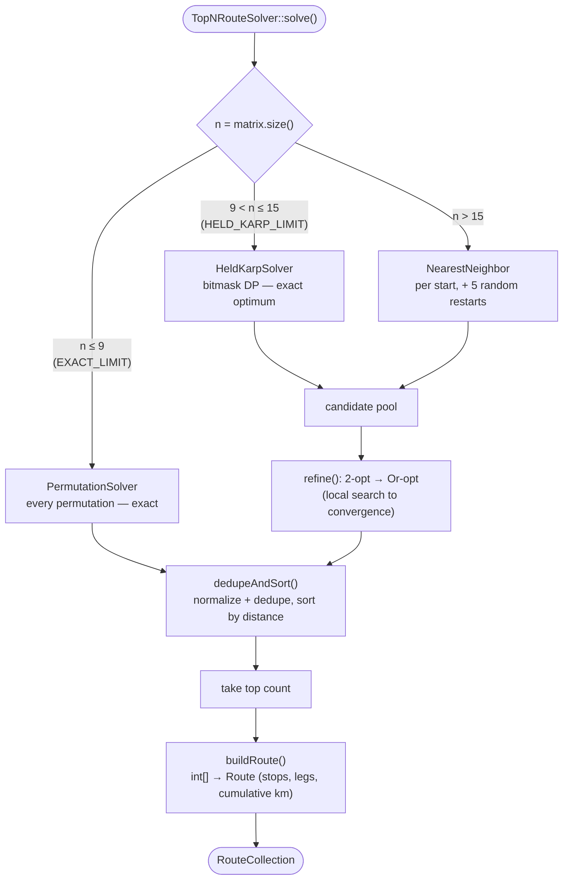

# Route-Solving Algorithms

The Traveling Salesman Problem (TSP) — find the shortest order to visit a set
of stops — is **NP-hard**: the number of possible tours grows factorially
with the number of stops `n`. `TopNRouteSolver`
(`Core/Solver/TopNRouteSolver.php`) picks a strategy based on `n` to balance
**optimality** against **runtime**, and additionally returns the **top-N**
distinct routes (not just the single best), deduplicating equivalent tours.

```
n ≤ 9    → PermutationSolver          (exact, exhaustive)
n ≤ 15   → HeldKarpSolver + heuristics (exact optimum + good runners-up)
n  > 15  → NearestNeighbor + 2-opt + Or-opt, multiple restarts (heuristic only)
```



All strategies operate on a precomputed `DistanceMatrix` (see
[DISTANCE_PROVIDERS.md](DISTANCE_PROVIDERS.md)) and respect `SolveOptions`:

- `returnToStart` (bool): treat the route as a closed loop (return to stop 0
  / depot at the end).
- `depotIndex` (?int): if set, the tour must start (and, for permutations,
  only start) at this index.

---

## Summary comparison

| Strategy | File | Complexity | Exact? | Used when |
|---|---|---|---|---|
| `PermutationSolver` | `Core/Solver/PermutationSolver.php` | O(n!) | Yes — true optimum + true ranking | n ≤ 9 |
| `HeldKarpSolver` | `Core/Solver/HeldKarpSolver.php` | O(2ⁿ·n²) time, O(2ⁿ·n) memory | Yes (single best tour only) | 10 ≤ n ≤ 15, as one candidate |
| `NearestNeighborStrategy` | `Core/Solver/NearestNeighborStrategy.php` | O(n²) | No (greedy construction) | n > 9, builds initial tours |
| `TwoOptOptimizer` | `Core/Solver/TwoOptOptimizer.php` | O(n²) per pass, until no improvement | No (local search) | refines every heuristic tour |
| `OrOptOptimizer` | `Core/Solver/OrOptOptimizer.php` | O(n²·segLen) per pass | No (local search) | refines every heuristic tour, after 2-opt |

---

## `PermutationSolver` — exhaustive search (n ≤ 9)

Generates **every permutation** of stop indices (recursively, via
`self::permutations()`), filters by `depotIndex` if set, and computes the
total distance of each via `TourMath::distance()`.

### Pros
- **Guaranteed true optimum** — by definition, since every possible tour is
  evaluated.
- **Genuinely distinct top-N runners-up** — because all candidates are real,
  the 2nd/3rd-best routes returned are real alternatives, not artifacts of a
  heuristic's randomness.
- Simple, easy to verify correct (used as the baseline in
  `HeldKarpSolverTest`/`TopNRouteSolverTest`).

### Cons
- **Factorial blowup**, measured on this codebase (haversine, PHP 8):

  | n | Permutations | Time | Peak memory |
  |---|---|---|---|
  | 8 | 40,320 | ~0.2 s | ~67 MB |
  | 9 | 362,880 | ~3.4 s | ~425 MB |
  | 10 | 3,628,800 | ~7 min | ~3.9 GB |

  n=10 is already far beyond what a synchronous HTTP request (or default
  PHP-FPM memory limit) can absorb — this is why `EXACT_LIMIT = 9` in
  `TopNRouteSolver`, and why the `max_addresses` system config defaults
  to 9 (see [CONFIGURATION.md](CONFIGURATION.md#max_addresses)).
- No way to "almost" use this for slightly larger n — it's all-or-nothing.

### When it's used
Automatically, whenever `DistanceMatrix::size() <= 9`. No configuration
needed.

---

## `HeldKarpSolver` — exact DP (10 ≤ n ≤ 15)

Classic **Held-Karp dynamic programming** algorithm:
`dp[mask][i]` = cheapest cost of a path starting at the depot, visiting
exactly the stops in `mask`, ending at stop `i`. Built bottom-up over all
`2^(n-1)` subsets, `O(2ⁿ·n²)` time and `O(2ⁿ·n)` memory.

For n=15: `2^14 = 16,384` subsets × 14² ≈ **3.2M** operations — fast (well
under a second), vs. 15! ≈ 1.3 trillion for exhaustive search.

**Free-start open paths use a virtual depot.** The DP needs a fixed
starting stop. For a closed loop that's free (any rotation is the same
loop), and a fixed `depotIndex` pins it explicitly — but for an *open path
with a free start* (the API default), pinning the start to stop 0 would
silently exclude better paths starting elsewhere. `HeldKarpSolver` instead
appends a phantom stop with zero-cost edges to/from every real stop,
solves the closed loop fixed at the phantom, and strips it — yielding the
exact optimal open path with *both endpoints chosen by the algorithm*, at
the same complexity (one extra node). Works unchanged on asymmetric
(road-network) matrices, since the DP only ever uses directed lookups.

### Pros
- **Guaranteed true optimum** for the *single best* tour, in time/memory
  that's exponentially smaller than exhaustive permutation (though still
  exponential — infeasible much past n≈18-20).
- Used as **one candidate** alongside heuristic tours (nearest-neighbor +
  restarts), so the top-N result always *includes* the true optimum even
  when n > 9.

### Cons
- **Only produces one tour** (the optimum) — does not enumerate near-optimal
  alternatives. The "runners-up" in the top-N for 10 ≤ n ≤ 15 come from the
  *heuristic* candidates (nearest-neighbor + restarts, refined by 2-opt/
  Or-opt), which may or may not be close to the true 2nd-best.
- Still exponential — `TopNRouteSolver` caps its use at `HELD_KARP_LIMIT = 15`
  precisely because memory/time become impractical beyond that (2^15 = 32768
  is roughly the practical ceiling for typical PHP memory limits).
- More complex to implement/maintain than the heuristic approaches (bitmask
  DP with path reconstruction).

### When it's used
Automatically, for `9 < n <= 15`, as one of several candidates fed into
`dedupeAndSort()`.

---

## `NearestNeighborStrategy` — greedy construction (n > 9, and as a seed for n ≤ 15)

Builds a tour by repeatedly stepping to the **closest unvisited stop**,
starting from `depotIndex` (or each possible start, if no depot is fixed) —
`O(n²)` per tour built.

`TopNRouteSolver` builds one nearest-neighbor tour per possible start point
(or just the depot, if fixed), **plus 5 randomized-restart tours** (random
initial order, then refined) — `RANDOM_RESTART_COUNT = 5` — to add diversity
beyond deterministic starting points.

### Pros
- **Fast and simple** — `O(n²)`, scales to hundreds of stops without issue.
- A reasonable starting point for local search: nearest-neighbor tours are
  typically within ~25% of optimal *before* refinement, and significantly
  better after 2-opt/Or-opt.
- Multiple starting points (+ random restarts) give the refinement steps a
  diverse set of local optima to escape from, improving the chance of
  finding genuinely different (and better) top-N candidates.

### Cons
- **Greedy, no lookahead** — can paint itself into a corner (e.g. leaves one
  far-away stop for last, requiring a long "return" leg). This is exactly
  what 2-opt/Or-opt exist to fix.
- **No optimality guarantee whatsoever** on its own — quality depends
  entirely on the subsequent local-search refinement.
- Random restarts add **non-determinism**: two runs on the same input can
  return different (though similarly-ranked) routes for n > 15. Unit tests
  for this range should tolerate this (or seed RNG / disable randomness if
  determinism is required).

### When it's used
Automatically, for `n > 9` (combined with Held-Karp for `n <= 15`), as the
seed for 2-opt/Or-opt refinement.

---

## `TwoOptOptimizer` — local search via segment reversal

Repeatedly looks for a pair of positions `(i, j)` where **reversing the
segment between them** shortens the total tour, and applies it — until no
such improvement exists (`IMPROVEMENT_EPSILON = 1e-9`). `O(n²)` per full
pass, with potentially multiple passes until convergence.

**Asymmetric (road-network) matrices are handled correctly.** Pure-math
providers (haversine/vincenty/postgis) produce symmetric matrices, where a
reversal only changes the two boundary edges — an `O(1)` delta. OSRM and
Google return *directed* road distances (one-way streets make A→B ≠ B→A),
so reversing a segment also re-prices every edge inside it in the opposite
direction. The optimizer checks `DistanceMatrix::isSymmetric()` once and,
for asymmetric matrices, adds the internal-edge term (an `O(segment)`
delta) — always using the provider's directed route distances, never
falling back to straight-line math.

Position 0 is never disturbed (it's the depot, or an arbitrary anchor for
free-start tours — on a symmetric matrix reversal symmetry makes this
lossless; on an asymmetric one it merely narrows the search neighborhood,
and moves are still only accepted when their true directed delta improves
the tour).

### Pros
- **Eliminates the most common heuristic flaw**: "crossing" edges (where the
  tour visually crosses over itself) — a single reversal always removes a
  crossing and never increases distance if applied only on improving moves.
- Well-understood, simple to implement correctly, deterministic given a
  starting tour.
- Typically brings a nearest-neighbor tour from ~25% above optimal to within
  ~5% — a large quality jump for `O(n²)` cost.

### Cons
- **Local optimum only** — 2-opt cannot perform a "relocation" (move a single
  stop elsewhere without reversing a whole segment); that's `OrOptOptimizer`'s
  job. A tour can be 2-opt-optimal yet still improvable by Or-opt.
- Convergence loop (`while ($improved)`) means worst-case multiple `O(n²)`
  passes — for very large n this can become noticeable, though still
  polynomial.

### When it's used
Automatically, applied to every heuristic tour (nearest-neighbor and random
restarts) before Or-opt, for `n > 9`.

---

## `OrOptOptimizer` — local search via segment relocation

Repeatedly tries **relocating a short segment (1–3 consecutive stops)** to a
different position in the tour, keeping the move if it shortens the total
distance (`MAX_SEGMENT_LENGTH = 3`, `IMPROVEMENT_EPSILON = 1e-9`). Like 2-opt,
position 0 is never moved.

### Pros
- **Complements 2-opt**: handles the "single stop is in a bad spot" case that
  segment-reversal can't fix directly (e.g. a stop that's geographically
  between two other stops but visited far later in the tour).
- Together, 2-opt + Or-opt is a well-established, effective combination
  ("2-opt + Or-opt" local search) that gets heuristic tours close to
  Held-Karp-quality for many practical instances.

### Cons
- **Still a local optimum** — 2-opt + Or-opt can get stuck in a tour that
  neither move can improve, but which is not globally optimal. This is why
  `TopNRouteSolver` runs **multiple random restarts** rather than relying on
  a single refinement run.

### When it's used
Automatically, applied after 2-opt to every heuristic tour, for `n > 9`.

> **Performance note**: `tryRelocate()` evaluates each candidate insertion
> point via `relocationDelta()` — an `O(1)` calculation that looks only at
> the (at most) four edges touching the segment's old and new boundaries,
> mirroring 2-opt's `reversalDelta()`. An earlier version recomputed the
> *entire* tour's `TourMath::distance()` (an `O(n)` sum) for every candidate,
> making each pass `O(n³·segLen)` instead of the `O(n²·segLen)` shown in the
> table above — for `n=50` this was the dominant cost of `refine()`, several
> seconds across all restarts. See [Performance & future
> work](#performance--future-work) below.

---

## How top-N is assembled (`TopNRouteSolver::solve`)

1. **Collect candidates**:
   - n ≤ 9: every permutation (exact).
   - 10 ≤ n ≤ 15: Held-Karp optimum + nearest-neighbor (per start) + 5 random
     restarts, each refined by 2-opt + Or-opt.
   - n > 15: nearest-neighbor (per start, or just the depot) + 5 random
     restarts, each refined by 2-opt + Or-opt.
2. **Deduplicate**: tours are normalized (`TourMath::normalize`, accounting
   for direction/rotation symmetry where applicable) and keyed
   (`TourMath::key`) — multiple candidates producing the same normalized
   tour collapse into one, and each kept entry's distance is recomputed
   from its normalized tour so the reported total always matches the
   returned stop order. **Direction matters on asymmetric matrices**: with
   OSRM/Google road distances, a tour and its reversal are different
   routes with different lengths, so reversal-equivalence is only applied
   when `DistanceMatrix::isSymmetric()` (rotations of a closed loop use
   identical directed edges and always collapse).
3. **Sort** by total distance, ascending.
4. **Take top `count`** (default 3, configurable via
   `genaker_comi_voyager.default_route_count` or per-request `routes`).
5. For each, build a full `Route` (stops + legs + cumulative distances),
   tag `rank`, `isShortest` (rank 1), and `deltaFromBestKm` (difference vs.
   the #1 route).

### Practical implications

- **For n ≤ 15, the #1 result is always the true optimum** (exact methods).
  For n > 15, #1 is the best heuristic found — usually very good, but not
  guaranteed optimal.
- **Requesting more routes than exist as distinct tours** (e.g. `routes=5`
  for n=2, where only 1 tour exists) simply returns fewer routes — `top` is
  `array_slice($candidates, 0, ...)` of however many deduped candidates exist.
- **Runners-up quality depends on n**: for n ≤ 9 they're guaranteed genuine
  2nd/3rd-best tours. For n > 9, they come from different heuristic
  starts/restarts and may be meaningfully worse than the true 2nd-best
  (though still locally-optimized, valid tours).

---

## Performance & future work

This section tracks where `TopNRouteSolver`'s time actually goes for
larger `n`, what's already been done about it, and options for further
tuning — including a possible **configurable solver strategy**, analogous
to `genaker_comi_voyager.distance_provider`.

### Done: Or-opt's O(1) relocation delta

For `n > HELD_KARP_LIMIT` (15), `collectCandidates()` builds `n + 5` initial
tours (one nearest-neighbor tour per starting stop, plus
`RANDOM_RESTART_COUNT = 5` random restarts) and runs `refine()` (2-opt then
Or-opt) on each. `OrOptOptimizer::tryRelocate()` used to recompute the
*entire* tour's distance (`TourMath::distance()`, an `O(n)` sum) for every
candidate insertion point — making each Or-opt pass `O(n³)` rather than the
`O(n²)` 2-opt achieves with its `reversalDelta()`.

`tryRelocate()` now uses `relocationDelta()`, an `O(1)` calculation that
looks only at the (at most) four edges touching the segment's old and new
boundaries (mirroring `TwoOptOptimizer::reversalDelta()`'s "before/after"
boundary-edge approach) — see `Core/Solver/OrOptOptimizer.php`. This brings
every Or-opt pass down to `O(n²)`, matching 2-opt, with identical results
(verified by a differential test comparing the `O(1)` delta against
brute-force `TourMath::distance()` recomputation across every
segment/insertion-point/open-vs-closed combination —
`Core/Tests/Unit/Solver/OrOptOptimizerTest.php`).

**Rough impact**: for `n=50`, a single Or-opt pass went from ~375,000
distance evaluations to ~7,500 — across `n + 5 = 55` restarts and several
passes each, this was the dominant cost of `refine()` (multi-second territory
before the fix, now negligible).

### Remaining cost for large n: `O(n)` restarts × `O(n²)` refinement

Even with the fix above, `collectCandidates()` for `n > 15` still does
`(n + 5)` full `refine()` runs, each `O(n²)` per pass. That's `O(n³)`
overall — fine for the "daily delivery route" sizes (n in the tens) this
solver targets, but it will start to be noticeable somewhere in the low
hundreds of stops. Two standard mitigations, **not yet implemented**:

- **Neighbor lists / "don't-look bits"**: instead of 2-opt/Or-opt
  considering *every* pair `(i, j)` (`O(n²)`), restrict candidates to each
  stop's `k` nearest neighbors (`k` ~ 8-20) using the existing
  `DistanceMatrix`. This is the standard way production TSP solvers scale
  2-opt/Or-opt past a few hundred stops, at the cost of (rarely) missing an
  improving move between two far-apart stops.
- **Fewer nearest-neighbor starts for large n**: currently one NN tour is
  built per possible starting stop (`n` of them). For large `n`, a fixed
  small number of NN starts (e.g. 3-5, chosen by spreading start points
  across the matrix) plus the existing random restarts would likely find
  comparably good tours for a fraction of the cost.

Neither is needed at the route sizes this bundle currently targets, so
they're recorded here as **options if/when larger routes become a real use
case**, rather than implemented speculatively.

### Open question: should the solving strategy be configurable?

Today, `EXACT_LIMIT` (9), `HELD_KARP_LIMIT` (15), and
`RANDOM_RESTART_COUNT` (5) are fixed constants in `TopNRouteSolver`, tuned
for "single delivery route" sizes. A natural extension — **not yet
implemented, proposed here for discussion** — would be a
`genaker_comi_voyager.solver_quality` system-config setting (mirroring
`distance_provider`'s registry pattern), with presets such as:

| Preset | `RANDOM_RESTART_COUNT` | Effect |
|---|---|---|
| `fast` | 0-1 | Minimal restarts; near-instant even for n in the hundreds, at some cost to route quality. |
| `balanced` (current default) | 5 | Today's behavior. |
| `thorough` | 15-20 | More restarts/diversity; better runners-up for larger n, at proportionally higher latency. |

This would directly answer "is the current heuristic good enough for my
route sizes, or do I need it to try harder (or run faster)?" without code
changes — the same way `distance_provider` lets a store trade off accuracy
vs. infrastructure cost. It's a moderate-sized addition (config tree,
`system_configuration.yml` entry, translations, threading the value from
`RouteOptimizationService`/`OptimizeRouteCommand` into `TopNRouteSolver`'s
constructor), so it's recorded here rather than implemented speculatively —
worth doing if/when route sizes routinely exceed `HELD_KARP_LIMIT` (15) and
the default 5 restarts prove insufficient (or excessive) in practice.
