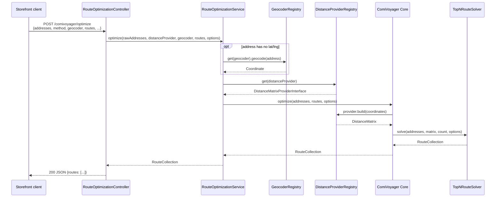

# API & CLI Reference

## HTTP API

### `POST /comivoyager/optimize`

- **File**: `Controller/RouteOptimizationController.php`
- **Routing**: `Resources/config/oro/routing.yml` — `genaker_comivoyager_optimize`,
  `options.frontend: true` (storefront route, not back-office)
- **ACL**: `Resources/config/oro/acls.yml` — `genaker_comivoyager_optimize`
  (`type: action`, `group_name: commerce`, `frontend: true`), enforced via
  `#[AclAncestor('genaker_comivoyager_optimize')]`
- **Auth**: requires an authenticated **frontend (storefront) session** with
  the above ACL granted. Unauthenticated requests are redirected to login —
  this is expected, not a bug.

#### Request flow



`method`/`geocoder` select the provider/geocoder for *this request only*
(via the registries shown above); when omitted, the registries fall back to
the `genaker_comi_voyager.distance_provider` / `.geocoder` system config
defaults. The CLI (`comivoyager:optimize`) follows the same
`Core::optimize()` path but skips `Controller`/`Service`/geocoding —
addresses must already have `lat`/`lng`.

#### Request body

```json
{
  "addresses": [
    {"label": "Customer A", "lat": 51.5074, "lng": -0.1278},
    {"label": "Customer B", "address": "10 Rue de Rivoli, Paris, France"},
    {"label": "Customer C", "lat": 52.5200, "lng": 13.4050}
  ],
  "method": "haversine",
  "geocoder": "nominatim",
  "routes": 3,
  "returnToStart": false,
  "depotIndex": null
}
```

| Field | Type | Required | Default | Notes |
|---|---|---|---|---|
| `addresses` | array of objects | **yes** | — | Min 2, max `genaker_comi_voyager.max_addresses` (default 9; larger values trade away exact runner-up routes — see [CONFIGURATION.md](CONFIGURATION.md#max_addresses)) entries (see [Errors](#errors)) |
| `addresses[].label` | string | no | `"Address {n}"` | Display label, echoed back in `stops[].address.label` |
| `addresses[].lat`, `addresses[].lng` | number/numeric string | no* | — | If present, used directly (no geocoding). Must be numeric, `lat` ∈ [-90, 90], `lng` ∈ [-180, 180] |
| `addresses[].address` | string | no* | — | Free-text address; geocoded if `lat`/`lng` absent |
| `method` | string | no | system config `genaker_comi_voyager.distance_provider` (default `haversine`) | One of `haversine`, `vincenty`, `osrm`, `google`, `postgis` — see [DISTANCE_PROVIDERS.md](DISTANCE_PROVIDERS.md) |
| `geocoder` | string | no | system config `genaker_comi_voyager.geocoder` (default `nominatim`) | One of `nominatim`, `google` — see [GEOCODING.md](GEOCODING.md) |
| `routes` | int | no | system config `genaker_comi_voyager.default_route_count` (default `3`) | Number of ranked routes to return |
| `returnToStart` | bool | no | `false` | Treat as a closed loop (return to stop 0 / depot) |
| `depotIndex` | int\|null | no | `null` | 0-based index of the address that must be the route's start |

\* Each address entry must have **either** `lat`+`lng` **or** `address`.

#### Response body (200 OK)

```json
{
  "routes": [
    {
      "rank": 1,
      "isShortest": true,
      "totalDistanceKm": 1031.7,
      "totalStops": 3,
      "averageLegKm": 515.85,
      "longestLegKm": 620.4,
      "deltaFromBestKm": 0.0,
      "stops": [
        {
          "sequence": 1,
          "addressLabel": "Customer A",
          "coordinate": {"lat": 51.5074, "lng": -0.1278},
          "legDistanceKm": null,
          "cumulativeDistanceKm": 0,
          "isStart": true,
          "isEnd": false
        },
        {
          "sequence": 2,
          "addressLabel": "Customer B",
          "coordinate": {"lat": 48.8566, "lng": 2.3522},
          "legDistanceKm": 343.6,
          "cumulativeDistanceKm": 343.6,
          "isStart": false,
          "isEnd": false
        },
        {
          "sequence": 3,
          "addressLabel": "Customer C",
          "coordinate": {"lat": 52.5200, "lng": 13.4050},
          "legDistanceKm": 688.1,
          "cumulativeDistanceKm": 1031.7,
          "isStart": false,
          "isEnd": true
        }
      ],
      "legs": [
        {"fromIndex": 0, "toIndex": 1, "distanceKm": 343.6, "cumulativeDistanceKm": 343.6},
        {"fromIndex": 1, "toIndex": 2, "distanceKm": 688.1, "cumulativeDistanceKm": 1031.7}
      ]
    }
  ],
  "shortestIndex": 0,
  "requestedCount": 3
}
```

| Field | Meaning |
|---|---|
| `routes[]` | Ranked routes, `rank` 1 = shortest. May contain fewer than `requestedCount` if fewer distinct tours exist. |
| `routes[].totalDistanceKm` | Sum of all leg distances |
| `routes[].totalStops` | Number of stops (includes the repeated start stop if `returnToStart`) |
| `routes[].averageLegKm` | `totalDistanceKm / count(legs)` |
| `routes[].longestLegKm` | Longest single leg |
| `routes[].deltaFromBestKm` | `totalDistanceKm - routes[0].totalDistanceKm` (0 for rank 1) |
| `routes[].stops[].addressLabel` / `coordinate` | The stop's `Address::label` and `{lat, lng}` |
| `routes[].stops[].isStart` / `isEnd` | First/last stop flags. `isEnd` is `false` on the start stop if `returnToStart` adds a closing stop |
| `routes[].stops[].legDistanceKm` / `cumulativeDistanceKm` | Distance and running total from the previous stop; `legDistanceKm` is `null` and `cumulativeDistanceKm` is `0` for the first stop |
| `shortestIndex` | Index into `routes[]` of the shortest route (always `0`, since routes are pre-sorted) |
| `requestedCount` | Echoes the resolved `routes` count used for solving |

#### Errors

| HTTP status | Condition | Example body |
|---|---|---|
| `400 Bad Request` | Invalid JSON body | `{"error": "Invalid JSON: Syntax error"}` |
| `400 Bad Request` | Missing/non-array `addresses` | `{"error": "Field \"addresses\" is required and must be an array."}` |
| `400 Bad Request` | An address entry is not an object, or has neither `lat`/`lng` nor `address` | `{"error": "Address at position 1 must have either \"lat\"/\"lng\" or a text \"address\"."}` |
| `400 Bad Request` | `lat`/`lng` present but not numeric (e.g. a typo like `"abc"`) | `{"error": "Address at position 1 has non-numeric \"lat\"/\"lng\"."}` |
| `400 Bad Request` | `lat`/`lng` out of range (`lat` ∉ [-90, 90] or `lng` ∉ [-180, 180]) | `{"error": "..."}` (from `Coordinate`'s constructor) |
| `400 Bad Request` | Fewer than 2 addresses | `{"error": "At least 2 addresses are required, 1 given."}` |
| `400 Bad Request` | More than `max_addresses` (default 9) addresses | `{"error": "Too many addresses: 50 given, maximum is 9."}` |
| `422 Unprocessable Entity` | Geocoding failed for a text address | `{"error": "Could not geocode address at position 1: \"...\"."}` |
| `422 Unprocessable Entity` | Distance provider unavailable (HTTP/DB error, missing API key, unknown provider, etc.) | `{"error": "OSRM distance provider is unavailable: ..."}` |
| `302 Found` (redirect to login) | Not authenticated / missing ACL | — |

---

## CLI: `comivoyager:optimize`

- **File**: `Command/OptimizeRouteCommand.php`
- **Scope**: only `haversine`/`vincenty` (pure-PHP) providers — does **not**
  go through `DistanceProviderRegistry`, `GeocoderRegistry`, or system
  config. No geocoding support (input must already have `lat`/`lng`).

### Usage

```bash
php bin/console comivoyager:optimize <input> [options]
```

| Argument/Option | Description | Default |
|---|---|---|
| `input` (argument) | Path to a JSON file, or `-` for stdin | required |
| `-m, --method` | `haversine` or `vincenty` | `haversine` |
| `-r, --routes` | Number of top routes to return | `3` |
| `--return-to-start` | Treat as closed loop | off |
| `--depot` | 0-based index of the fixed start address | none (free start) |

### Input format

A JSON array of objects, each with `lat`/`lng` (required) and optional
`label`:

```json
[
  {"label": "London", "lat": 51.5074, "lng": -0.1278},
  {"label": "Paris", "lat": 48.8566, "lng": 2.3522},
  {"label": "Berlin", "lat": 52.5200, "lng": 13.4050}
]
```

### Example

```bash
echo '[
  {"label":"London","lat":51.5074,"lng":-0.1278},
  {"label":"Paris","lat":48.8566,"lng":2.3522},
  {"label":"Berlin","lat":52.5200,"lng":13.4050}
]' | php bin/console comivoyager:optimize - --method=vincenty --routes=2 --return-to-start
```

Output: the same `RouteCollection::toArray()` JSON shape as the HTTP API
(see above), pretty-printed.

### Exit codes

- `0` (`Command::SUCCESS`) — routes printed.
- `1` (`Command::FAILURE`) — unreadable input file, invalid JSON, missing
  `lat`/`lng` on an address, unknown `--method`, or fewer than 2 addresses
  (`InsufficientAddressesException`). Error message printed via
  `SymfonyStyle::error()`.
